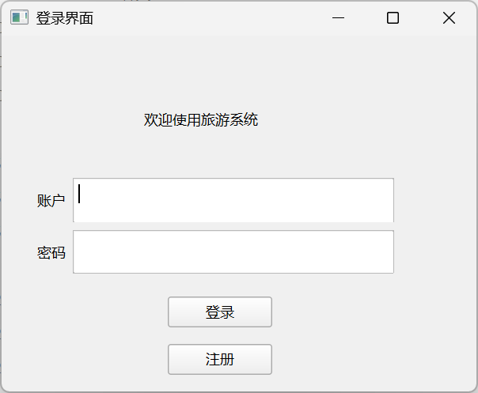
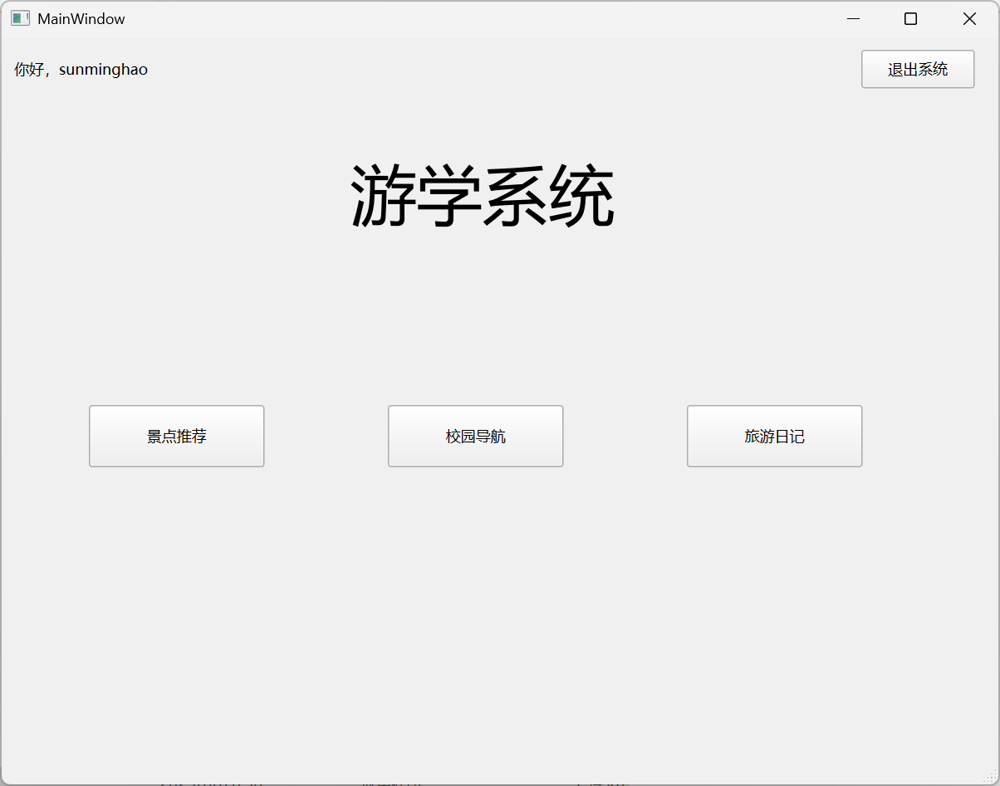
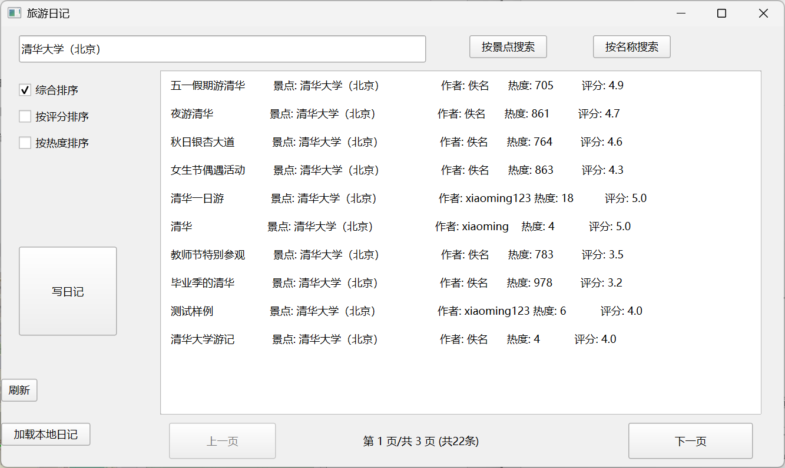
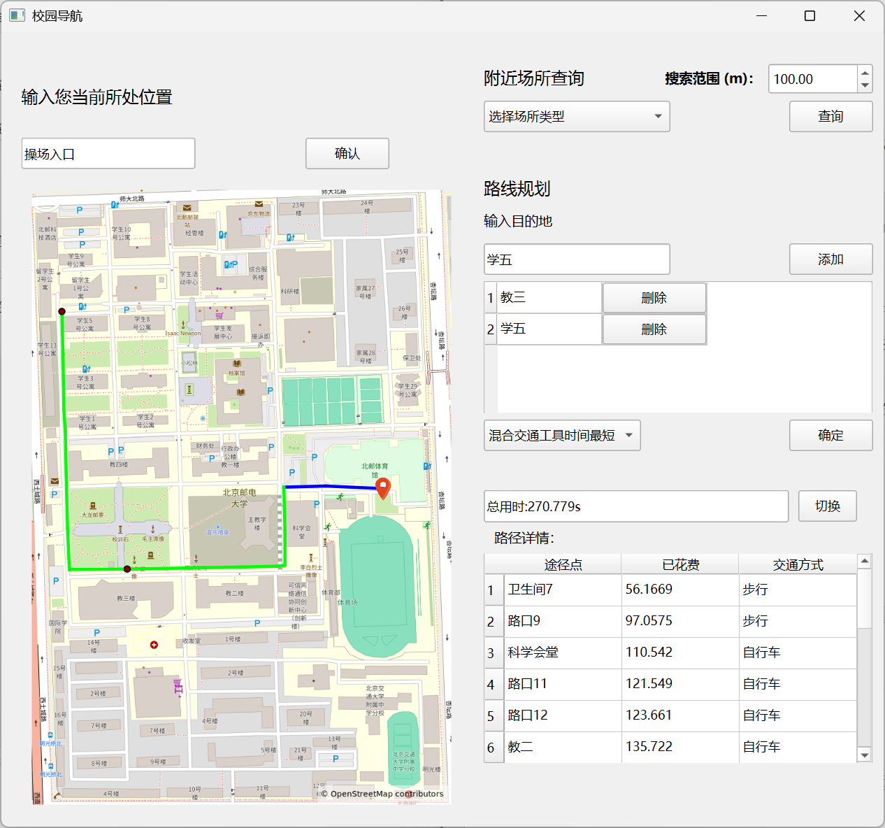
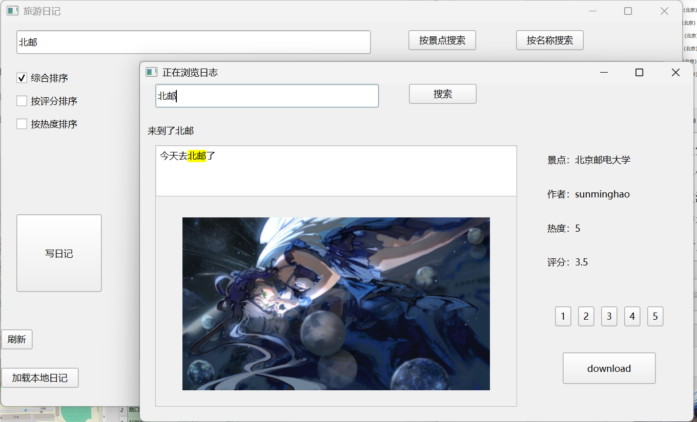

# 校园旅游导航与推荐系统

一个集【旅游推荐】、【路线规划】、【场所查询】与【旅游日记管理】于一体的校园旅游导航系统。支持路径可视化、关键词搜索、地点推荐与哈夫曼压缩日记存储，旨在提升个性化校园旅游体验。

## 🧭 项目简介

该系统围绕用户在旅游前、中、后不同阶段的需求进行设计：

- **旅游前**：通过热度、评分与关键词搜索推荐景点；
- **旅游中**：提供路径规划、校园导航与周边设施查询；
- **旅游后**：支持日记撰写、搜索、浏览与压缩下载。

## ✨ 核心功能

### 📌 1. 旅游推荐
- Top-K 排序算法支持按评分/热度/类别推荐景点
- 模糊搜索景点名称，快速定位
- 可一键跳转到该景点对应的旅游日记列表

### 🗺️ 2. 校园导航
- 输入场所名快速定位当前位置与目的地
- 路线规划支持多策略：距离优先 / 步行时间优先 / 混合时间优先
- 路径可视化展示，地图支持标记与导航
- 查询周边设施（如超市、卫生间），可添加为导航目标

### 📝 3. 旅游日记系统
- 支持撰写、上传图片、压缩存储与本地浏览
- 日记浏览支持按热度、评分等排序
- 支持全文搜索（KMP 算法）与关键词筛选
- 哈夫曼编码实现无损压缩下载功能

### 🔒 4. 用户系统
- 用户注册与登录
- 用户行为与数据持久化存储（MySQL）

---

## ⚙️ 技术栈与开发环境

| 类别 | 技术 |
|------|------|
| 开发语言 | C++17 |
| GUI 框架 | Qt 6.8.3 |
| 数据存储 | MySQL 8.0 |
| 构建工具 | qmake（Qt Creator） |
| 地图数据 | GeoJSON 格式静态地图 |

---

## 🧱 系统架构

采用模块化结构，前后端松耦合：

- **主界面**：统一导航入口
- **景点推荐模块**：排序 + 搜索功能，基于数据库
- **校园导航模块**：地图静态加载 + Dijkstra 多策略路径规划
- **旅游日记模块**：内容管理 + 搜索 + 压缩
- **数据库模块**：MySQL 提供统一持久化服务

> 地图数据为静态文件，系统启动时加载 GeoJSON 初始化图结构。

---

## 🧩 模块结构说明

### 📍 地点推荐模块
- `kmp_search`：关键词匹配
- `top_k_algorithm`：堆排序实现 TopK
- `site_recommend`：界面展示 + 数据排序

### 🗺️ 校园导航模块
- `map_elements`：场所与道路数据结构
- `route_plan`：地图加载 + 路径计算 + 场所查询
- `campus_nav`：导航页面交互逻辑

### 📖 旅游日记模块
- `diarywindow`, `diaryread`, `writewidget`：对应日记浏览、阅读与撰写界面
- `HuffmanCoding`：支持日记压缩与本地解码展示
- `kmp_search`, `top_k_algorithm`：支持日记搜索与排序

### 🧬 用户系统与数据库
- `database_connection`, `update_database`：封装数据库连接与 CRUD 操作
- `login`, `register`：用户认证界面

---

## 🧪 构建与运行

### 环境要求
- Qt Creator（推荐使用 Qt 6.8.3）
- C++17 编译器（如 MSVC, MinGW）
- MySQL 数据库（需提前部署，初始化表结构）

### 编译方式（使用 Qt Creator）
1. 打开 `travel-system.pro` 工程文件
2. 编译并运行项目
3. 配置数据库连接参数（详见 `database_connection` 模块）

---

## 👥 项目成员

| 姓名 | 主要职责 |
|------|----------|
| 刘梓宸 | 景点数据与推荐算法（TopK、KMP）、推荐界面搭建 |
| 胡振宇 | 数据结构设计、数据库设计与操作、日记模块开发 |
| 孙明皓 | 地图数据构建、校园导航模块实现、系统调试与优化 |

---

## 📂 项目结构预览
```bash
├── travel-system.pro           # Qt 工程文件
├── school_map.qrc              # Qt 资源文件
├── data/                       # 静态资源（图标、地图、GeoJSON 地图数据）
│   ├── icon.png
│   ├── map.png
│   └── map_of_bupt.geojson
├── include/                    # 头文件
│   ├── *.h                     # 各功能模块头文件
│   ├── simple_class/           # 简单结构类定义（如 user、diary、location 等）
│   └── tool_class/             # 工具类头文件（如 Huffman 编码、数据库封装等）
├── src/                        # 源代码文件
│   ├── *.cpp                   # UI 与逻辑实现
│   └── tool_class/             # 对应工具类的实现
├── ui/                         # Qt Designer 生成的 UI 文件
│   ├── *.ui
```
## 📸 示例界面展示





